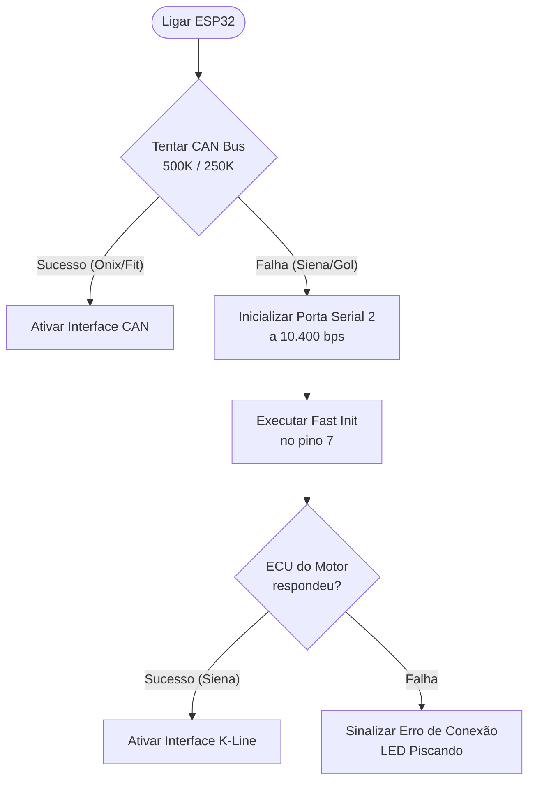

# 🔌 Hardware Universal — CAN Bus & K-Line no PulseDash

Para transformar o **PulseDash** em um produto comercial de sucesso, ele precisa ser **100% universal**. Isso significa que a nossa placa de hardware baseada no ESP32 deve conseguir ler tanto carros modernos via **CAN Bus** (Onix, Honda Fit, etc.) quanto carros nacionais muito populares que usam **K-Line** (Siena, Palio, Uno, Gol, Celta, Corsa).

Esta nota técnica descreve o esquema de hardware e software necessário para integrar a K-Line ao lado da CAN Bus no seu projeto.

---

## 🛠️ 1. O Circuito de Hardware (K-Line + CAN Bus)

O ESP32 operará com **dois transceptores simultâneos** no mesmo conector OBD2:

```text
               ┌──────────────┐
               │    ESP32     │
               │              │
               │ GPIO 17 (TX) ┼───────► [ Transceptor CAN ] ───► Pino 6 (CAN-H)
               │ GPIO 16 (RX) ┼◄──────  [   SN65HVD230   ] ───► Pino 14 (CAN-L)
               │              │
               │ GPIO 4  (TX) ┼───────► [ Transceptor K-Line ] ──► Pino 7 (K-Line)
               │ GPIO 5  (RX) ┼◄──────  [  L9637D / Trans.  ]
               └──────────────┘
```

### Opção A: O Chip Dedicado K-Line (Recomendado para a Placa Final)
O chip **L9637D** (ou **MC33660**) é um circuito integrado minúsculo (SOIC-8) muito barato projetado especificamente para isso. Ele faz a interface bidirecional entre os 3.3V do ESP32 e os 12V da K-Line com proteção automotiva contra surtos.

### Opção B: Circuito com Transistores Discretos (Ideal para Protótipo na Protoboard)
Se você quiser montar e testar agora mesmo usando peças comuns que compra em qualquer lojinha de eletrônica por centavos, pode montar este circuito conversor bidirecional:

* **Componentes necessários:**
  * 1 Transistor NPN (ex: **BC547** ou similar)
  * 1 Transistor PNP (ex: **BC557** ou similar)
  * 1 Diodo comum (ex: **1N4148** ou **1N4007**)
  * 3 Resistores de **10kΩ**
  * 2 Resistores de **1kΩ**

* **Esquema de ligação:**
  * O Transistor PNP conecta o pino 7 (K-Line) da OBD2 à linha de 12V do carro através de um resistor pull-up.
  * O Transistor NPN chaveia a K-Line para o terra (0V) quando o ESP32 envia dados pelo pino TX.
  * Um divisor de tensão simples com diodo reduz o sinal de recepção de 12V da K-Line para os 3.3V seguros para o pino RX do ESP32.

---

## 💻 2. A Lógica de Software (Autodetect de Protocolo Físico)

No código principal do PulseDash, a inicialização fará o seguinte fluxo inteligente:



### Como funciona o "Fast Init" (Despertar da K-Line):
Para "acordar" a ECU do Siena no pino 7 antes de mandar dados, o ESP32 deve fazer uma pulsação física simples na linha:
1. Mantém o pino TX em **Nível Baixo (0V)** por **25 milissegundos**.
2. Mantém o pino TX em **Nível Alto (3.3V)** por **25 milissegundos**.
3. Inicializa a porta serial UART do ESP32 (`Serial2.begin(10400, SERIAL_8N1, 5, 4)`).
4. Envia o comando de inicialização do padrão **KWP2000**: `0xC1 0x33 0xF1 0x81 0x66`.
5. A ECU responde com os bytes de confirmação (`0x83 0xF1 0x33 0xC1 ...`).
6. A partir deste momento, a comunicação está aberta! O ESP32 pode ler o RPM enviando bytes comuns via Serial2 (`0x02 0x01 0x0C`) e receber a resposta em tempo real a 60Hz.

---

## 📈 3. Vantagem Comercial do Produto
Ao adotar esse design duplo (CAN + K-Line):
* **Universalidade:** O seu painel funcionará em **100% dos carros nacionais** fabricados a partir de 2000.
* **Custo Baixo:** O acréscimo de custo na placa de circuito impresso (PCI) é de menos de R$ 5,00.
* **Diferencial Competitivo:** A maioria dos dashboards no mercado só suporta CAN ou exige adaptadores ELM327 externos caros. O PulseDash terá os dois barramentos integrados na mesma placa nativa!
